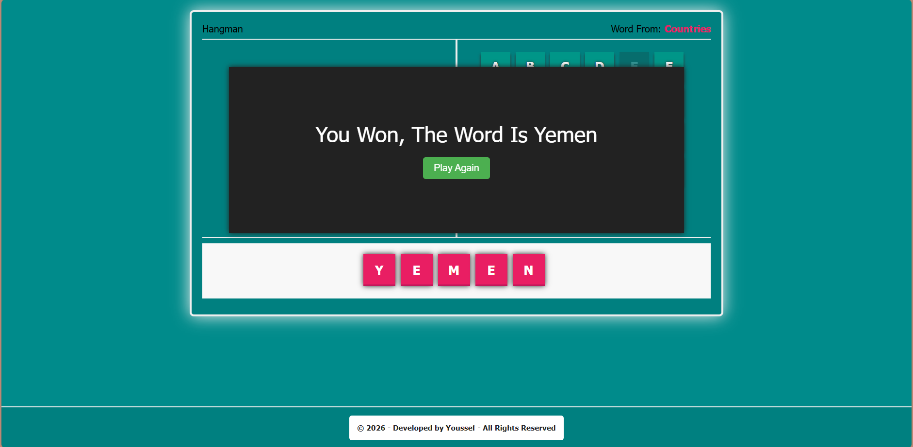
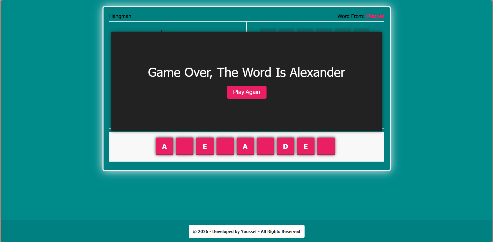
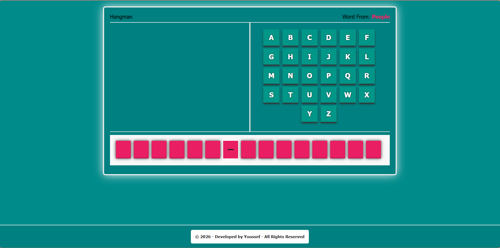

# 🎮 Hangman Game

🎮 A modern, interactive Hangman game with responsive design, sound effects, and smooth animations built with pure JavaScript.

## 📸 Screenshots

### 🏆 Win State


### 😔 Lose State  


### 🎮 Main Interface


## ✨ Features
📱 Responsive design for all devices
🎵 Sound effects and animations
🔄 Play again functionality
🏆 Win/Loss detection system
🎯 Multiple word categories
⌨️ Interactive letter selection

## 🛠️ Technologies Used
- HTML5 Semantic Markup
- CSS3 with Flexbox & Media Queries
- Vanilla JavaScript ES6
- DOM Manipulation
- Event Handling

## 🎮 How to Play
1. Open `index.html` in your browser
2. Click on letters to guess the hidden word
3. Wrong guesses will draw parts of the hangman
4. Win by guessing the complete word before the hangman is fully drawn
5. Use the "Play Again" button to start a new game with a random word

## 📂 Project Structure
```
hangman-game/
├── index.html          # Main HTML file
├── main.css            # Styling and responsive design
├── main.js             # Game logic and interactions
├── README.md           # Project documentation
├── screenshots/        # Game screenshots
│   ├── win-state.png
│   ├── lose-state.png
│   └── main-interface.png
└── audio/              # Sound effects
    ├── success.mp3
    └── fail.mp3
```

## 🎯 Word Categories
- **Programming** - php, javascript, python, etc.
- **Movies** - Prestige, Inception, Parasite, etc.
- **People** - Albert Einstein, Cleopatra, etc.
- **Countries** - Syria, Egypt, Palestine, etc.

## 📱 Fully Responsive
- 🖥️ Desktop - Full keyboard experience
- 📱 Tablet - Optimized touch interface
- 📱 Mobile - Compact and user-friendly

## 🚀 Getting Started
1. Clone this repository
2. Open `index.html` in your web browser
3. Start playing immediately!

## � Play Online
**🔗 [Play the Game Here](https://youssefali20022.github.io/Hangman-Game/)**

Experience the game directly in your browser without any installation!

## �🌟 Game Features
- **8 Wrong Attempts** - Progressive hangman drawing
- **Sound Feedback** - Success and failure sounds
- **Smooth Animations** - CSS transitions and effects
- **Instant Replay** - Play again without page reload
- **Category Display** - Shows current word category

## 🎨 Design Highlights
- Modern teal and darkcyan color scheme
- Smooth hover effects and transitions
- Professional popup messages
- Clean and intuitive interface

---

**Built with ❤️ using HTML, CSS, and JavaScript**
